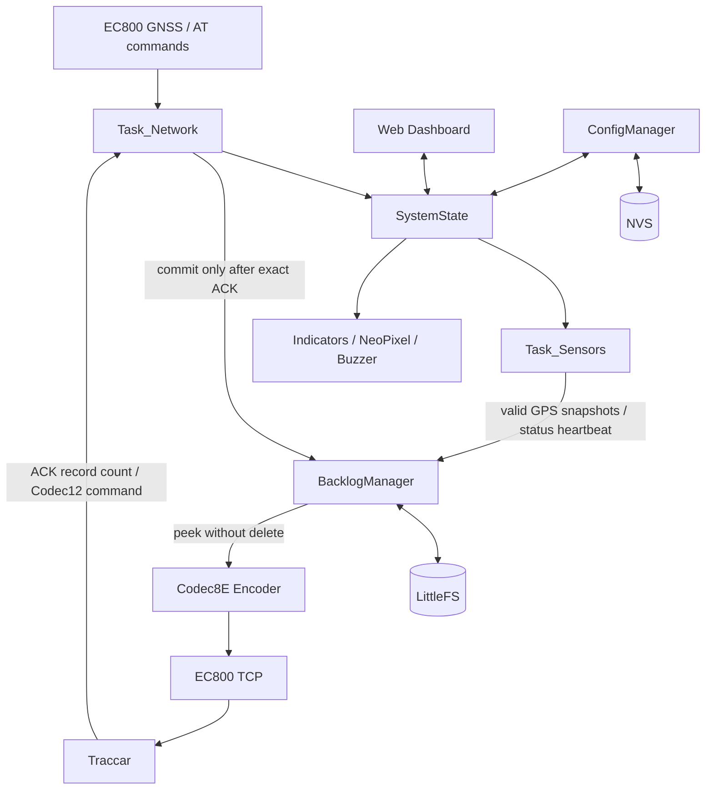

# ESP32-S3 GPS Tracker V2

Firmware giám sát hành trình chạy trên ESP32-S3, sử dụng Quectel EC800 cho 4G/GNSS và gửi dữ liệu tới Traccar bằng Teltonika Codec 8 Extended (`0x8E`). Hệ thống hỗ trợ gom nhiều điểm GPS trong một packet, lưu backlog bền vững, heartbeat khi mất GPS, điều khiển ACC vật lý/ảo, chế độ tiết kiệm pin và Web Dashboard cục bộ.

> Tài liệu liên quan: [REQUIREMENTS.md](REQUIREMENTS.md), [FIXES_2026-07-01.md](FIXES_2026-07-01.md), [COMPLETION_2026-07-01.md](COMPLETION_2026-07-01.md).

## Tính năng chính

- Đọc GNSS từ EC800: latitude, longitude, speed, course, altitude, satellites, PDOP, HDOP và UTC timestamp.
- Gửi Teltonika Codec 8E qua TCP, đăng nhập bằng IMEI và xác minh ACK.
- Lấy mẫu GPS mặc định mỗi 10 giây, gom tối đa 6 AVL records và gửi khoảng mỗi 60 giây khi ACC ON.
- Lưu tối đa 5.000 records vào LittleFS khi mất mạng hoặc ACK không hợp lệ.
- Chỉ xóa records sau khi ACK 4-byte bằng đúng số records đã gửi.
- Khi mất GPS, dùng last-known location thật để gửi status heartbeat với GNSS invalid; không gửi tọa độ giả `(0,0)`.
- Khi ACC OFF, chuyển sang `SAVE_MODE`, tắt GNSS và chỉ mở TCP trong thời gian gửi một status record mỗi 300 giây.
- Điều khiển ACC vật lý/ảo và cấu hình từ xa bằng Traccar custom command.
- Web Dashboard cấu hình server, Wi-Fi, chu kỳ truyền và mô phỏng trạng thái/cảnh báo.
- Quản lý cảm biến vân tay UART, NeoPixel, LED trạng thái, buzzer và OTA firmware.

## Phần cứng và chân kết nối

| Thành phần | Kết nối mặc định |
|---|---|
| ESP32-S3 | ESP32-S3-WROOM-N16R8, 16 MB Flash, 8 MB PSRAM |
| EC800 UART | TX GPIO4, RX GPIO5 |
| EC800 PWRKEY / RESET | GPIO38 / GPIO39 |
| Fingerprint UART | TX GPIO9, RX GPIO10 |
| Fingerprint Wake | GPIO11 |
| VBAT ADC | GPIO17 |
| ACC vật lý | GPIO3 |
| LED trạng thái | GPIO21 |
| NeoPixel | GPIO47 |
| Buzzer | GPIO41 |

Các chân và giá trị mặc định nằm trong [`include/config.h`](include/config.h).

## Cấu hình mặc định

| Cấu hình | Giá trị |
|---|---:|
| Firmware version | `1.2.0` |
| GPS sample interval | 10 giây |
| Số records tối đa mỗi packet | 6 |
| Upload timeout khi ACC ON | 60 giây |
| Heartbeat khi ACC OFF | 300 giây |
| TCP khi ACC OFF | Mở → login → gửi 1 record → ACK → đóng |
| Fingerprint retry khi ACC OFF | 600 giây |
| System debug log | NORMAL: 10 giây; SAVE: 60 giây |
| VBAT calibration multiplier | `11.225` |
| Backlog tối đa | 5.000 records |
| Traccar TCP port | 5027 |
| Wi-Fi AP | `S3_GPS_Tracker` |
| Dashboard | `http://192.168.4.1` |

`sampleInterval`, `batchSize`, server, ACC mode và các thiết lập dashboard được lưu trong NVS và vẫn còn sau khi restart.

## Luồng GPS và multi-record Codec 8E

### ACC ON — chế độ normal

1. Network task lấy dữ liệu GNSS từ EC800.
2. Sensors task chụp một snapshot hợp lệ theo `sampleIntervalSec`.
3. Mỗi snapshot giữ nguyên timestamp, tọa độ, speed, course, altitude, satellites và IO tại thời điểm lấy mẫu.
4. Snapshot được ghi vào LittleFS backlog; không lấy trung bình và không ghi đè timestamp.
5. Khi backlog đạt `batchSize`, hoặc hết timeout truyền, firmware encode nhiều AVL records trong cùng một packet.
6. `Number of Data 1` và `Number of Data 2` bằng số records thực tế. Data Field Length và CRC-16/IBM được tính trên toàn payload.
7. Traccar phải trả ACK dạng `000000NN`. Records chỉ được commit khi `NN` bằng số records đã gửi.

Ví dụ với cấu hình mặc định:

```text
T+00s  sample #1
T+10s  sample #2
T+20s  sample #3
T+30s  sample #4
T+40s  sample #5
T+50s  sample #6
       -> 1 packet Codec 8E chứa 6 AVL records
       <- ACK 00000006
```

### GPS mất fix

- Fix không hợp lệ không được đưa vào buffer GPS tốc độ cao.
- Nếu đã có last-known location thật, firmware có thể gửi status record tại vị trí cuối cùng với `satellites=0`, `speed=0`, `course=0`, `PDOP=0`, `HDOP=0` và IO 69 `GNSS Status=0`.
- Nếu chưa từng có vị trí hợp lệ, firmware không encode `(0,0)` và bỏ qua heartbeat thay vì tạo điểm sai trên bản đồ.

## Chế độ nguồn theo ACC

### ACC ON

- Send mode: `NORMAL`.
- GNSS được poll thường xuyên.
- Sampling dùng `set_sample` (mặc định 10 giây).
- Packet dùng `set_batch` (mặc định 6 records).
- Backlog đạt batch hoặc timeout 60 giây sẽ được gửi.

### ACC OFF

- Send mode: `SAVE_MODE`.
- Không tạo chuỗi GPS samples 10 giây.
- GNSS được tắt bằng `AT+QGPSEND`; heartbeat dùng last-known location với `gpsFix=0` và `satellites=0`.
- TCP không được giữ liên tục. Mỗi 300 giây firmware mở TCP, login Codec8E, gửi đúng một record, chờ ACK rồi `AT+QICLOSE=0`.
- Nếu ACK thất bại, firmware đóng socket, mở/login lại và thử thêm tối đa một lần. Nếu vẫn lỗi, record được giữ trong backlog đến chu kỳ sau.
- Mỗi chu kỳ tạo heartbeat mới với system timestamp hiện tại; không tái sử dụng timestamp GNSS cũ.
- Fingerprint offline chỉ retry mỗi 600 giây; system monitor và debug log chạy thưa hơn.
- Chuyển ACC OFF → ON sẽ thoát power-save và yêu cầu gửi backlog còn lại.

EC800 vẫn đăng ký mạng nhưng TCP/GNSS không chạy liên tục trong `SAVE_MODE`. `AT+CEREG?` chỉ dùng để quan sát đăng ký mạng trước khi cần kết nối, theo health-check 10 phút hoặc sau lỗi socket/ACK.

## Teltonika Codec 8E và IO mapping

Codec 8 Extended sử dụng IO count và IO ID dài 2 byte. Mapping hiện tại của firmware:

| AVL ID | Kích thước | Giá trị |
|---:|---:|---|
| 239 | 1 byte | Ignition/ACC |
| 66 | 2 byte | Điện áp nguồn, millivolt |
| 67 | 1 byte | Battery level, phần trăm theo mapping tùy biến của dự án |
| 70 | 2 byte | Nhiệt độ ×10 |
| 240 | 1 byte | GSM signal level 0–5 |
| 1 | 1 byte | Digital Input 1 |
| 69 | 1 byte | GNSS status |
| 179 | 4 byte | Total mileage |
| 181 | 2 byte | PDOP ×10 |
| 182 | 2 byte | HDOP ×10 |

> Ý nghĩa AVL ID có thể khác giữa các model Teltonika. Mapping trên là contract giữa firmware này và parser Traccar đang dùng; không nên áp dụng như bảng chung cho mọi thiết bị Teltonika.

## Backlog và độ tin cậy

- Dữ liệu được lưu trong ring buffer LittleFS với hai metadata slot và checksum.
- Records cũ chưa ACK không bị ghi đè.
- NORMAL retry tối đa ba lần trên socket hiện tại; SAVE đóng/mở TCP và login lại tối đa một lần sau ACK timeout.
- ACK sai, timeout, TCP lỗi hoặc metadata commit lỗi đều giữ records để phát lại.
- `force_send`, reconnect, restart và chuyển power mode không xóa backlog.
- Factory reset hiện giữ backlog, chỉ reset custom config.

## Custom commands từ Traccar

Command được gửi qua Codec12 command channel. Tên command không phân biệt chữ hoa/chữ thường ở các command mới.

| Command | Chức năng / phản hồi chính |
|---|---|
| `acc1`, `acc0` | Chuyển sang ACC ảo và bật/tắt khóa. Ví dụ: `ACC=1,MODE=VIRTUAL`. |
| `acc?` | Trả ACC ON/OFF, physical/virtual, IO239, DIN1, send mode, sample, batch và backlog. |
| `acc_mode,physical` | Dùng GPIO ACC vật lý. |
| `acc_mode,virtual` | Dùng trạng thái ACC ảo. |
| `status`, `config` | Trạng thái tổng quan: kết nối, IMEI, pin, RSSI, ACC, GPS, sample, batch, mode và backlog. |
| `gps` | Tọa độ, speed, satellites và fix hiện tại. |
| `backlog` | Số records cùng timestamp cũ nhất/mới nhất. |
| `force_send` | Queue yêu cầu gửi ngay; nếu backlog rỗng có thể tạo status record từ last-known location. |
| `reconnect` | Đóng TCP, login IMEI lại và giữ nguyên backlog. |
| `gnss_restart` | Restart riêng GNSS bằng `QGPSEND` rồi `QGPS=1`. |
| `set_batch,N` | Đặt batch size `1–20`, lưu NVS. |
| `set_sample,N` | Đặt sample interval `5–300` giây, lưu NVS. |
| `set_interval,N` | Đặt upload timeout khi ACC ON, `5–3600` giây. |
| `set_server,host,port` | Đổi Traccar server và port. |
| `beep` | Phát ba tiếng buzzer. |
| `led,on`, `led,off` | Ép LED bật/tắt. |
| `fingerprint` | Trả số người dùng vân tay đã cache. |
| `restart`, `reboot`, `device_restart` | Lưu config và restart ESP; backlog LittleFS được giữ nguyên. |
| `factory_reset` | Sinh mã xác nhận sáu chữ số có hiệu lực 60 giây. |
| `factory_reset,CODE` | Reset config khi CODE hợp lệ; giữ backlog và IMEI phần cứng. |

Các thao tác modem như `force_send`, `reconnect` và `gnss_restart` trả về trạng thái `queued/requested`; `Task_Network` thực thi ngay sau đó để tránh nhiều task truy cập UART cùng lúc.

`acc0`/`acc1` chấp nhận cả Codec12 ASCII và custom command dạng HEX của Traccar (`AC C0`/`AC C1`). Với các command chữ khác, nên cấu hình Traccar gửi dạng text/ASCII thay vì bật tùy chọn HEX.

## Web Dashboard

1. Kết nối Wi-Fi `S3_GPS_Tracker`.
2. Mật khẩu mặc định: `s3gpspassword`.
3. Mở `http://192.168.4.1`.

Dashboard hiển thị GPS, pin, ACC, alarm, network, log, fingerprint và cấu hình. ACC command từ Traccar cập nhật cùng `SystemState`, vì vậy công tắc ACC ảo trên web tự đồng bộ ở lần polling kế tiếp.

> Hãy đổi SSID/mật khẩu mặc định khi triển khai thực tế.

## Build và flash

Yêu cầu:

- Visual Studio Code và PlatformIO, hoặc PlatformIO Core.
- Cáp USB hỗ trợ data.
- Board ESP32-S3 đúng biến thể N16R8.

Build bằng terminal:

```powershell
& "$env:USERPROFILE\.platformio\penv\Scripts\platformio.exe" run
```

Upload:

```powershell
& "$env:USERPROFILE\.platformio\penv\Scripts\platformio.exe" run --target upload
```

Serial monitor:

```powershell
& "$env:USERPROFILE\.platformio\penv\Scripts\platformio.exe" device monitor --baud 115200
```

Project pin pioarduino `55.03.39`, Arduino-ESP32 `3.3.9` và ESP-IDF `5.5.4`. Khi nâng cấp từ layout partition cũ, nên upload qua USB một lần vì OTA không ghi lại partition table.

## Log cần kiểm tra

### Multi-record bình thường

```text
GPS sample queued: ts=..., backlog=6/6
Codec8E batch: records=6/6, dataLength=..., crc=..., reason=full
AVL[0]: ts=..., lat=..., lon=..., sats=...
...
Sent and ACKed 6 records.
```

### Chuyển power-save

```text
ACC changed: ON -> OFF
[POWER] Enter SAVE_MODE: acc=off, sendInterval=300s, batchSize=1, tcp=open-send-close, gnss=off-lastKnown
[SAVE] Heartbeat queued: now=..., lastKnown=..., gpsFix=0, sats=0, reason=save_heartbeat
[SAVE] Opening TCP for one-shot send
Codec8E Login Accepted!
Codec8E batch: records=1/1, ..., reason=save_timer
Sent and ACKed 1 records.
[SAVE] ACK OK, closing TCP
AT TX: AT+QICLOSE=0
```

### Status debug

NORMAL ghi mỗi 10 giây, SAVE ghi mỗi 60 giây với cùng một định dạng:

```text
[SYSTEM] mode=SAVE io={acc:0,phy:0,virt:0,src:PHY} power={vbat:3.96V,pct:73%} net={reg:1,tcp:0,rssi:24} gps={fix:0,sats:0} backlog=2 heap=79700 temp=42.1C
```

### Không có vị trí hợp lệ

```text
No GPS fix and no last known location; heartbeat not queued
```

## Checklist kiểm thử với Traccar

1. ACC ON và GPS tốt: sau một phút Traccar nhận 5–6 positions có timestamp khác nhau, ACK đúng record count.
2. Mất mạng: backlog tăng; khi mạng trở lại records được phát lại và chỉ commit sau ACK.
3. Mất GPS sau khi có fix: Traccar vẫn nhận status heartbeat, GNSS status bằng 0 và không xuất hiện chuyển động giả.
4. Boot chưa từng có GPS: không xuất hiện điểm `(0,0)`.
5. ACC OFF: không có packet 10 giây; mỗi chu kỳ chỉ gửi một record, TCP phải đóng giữa hai chu kỳ.
6. ACC OFF → ON: sampling nhanh hoạt động lại và backlog được gửi.
7. Kiểm tra `acc1`, `acc0`, `acc?`, `force_send`, `reconnect`, `gnss_restart`, `set_batch`, `set_sample` và factory-reset confirmation.

## Kiến trúc



## Cấu trúc mã nguồn

| Thành phần | Vai trò |
|---|---|
| `src/main.cpp` | FreeRTOS tasks, state machine mạng, sampling, power-save và command handler |
| `src/Codec8E.*` | Login, multi-record AVL encoder, CRC và Codec12 command |
| `src/EC800.*` | Driver AT, GNSS, network và TCP |
| `src/BacklogManager.*` | Persistent ring buffer và ACK commit |
| `src/ConfigManager.*` | NVS config và last-known location |
| `src/WebDashboard.*`, `include/WebHTML.h` | HTTP API và giao diện web |
| `src/Fingerprint.*` | Driver cảm biến vân tay |
| `src/Indicators.*` | LED, NeoPixel và buzzer |
| `include/SystemState.h` | Trạng thái dùng chung giữa các task |

## Giới hạn hiện tại

- Chưa có automated integration test với một Traccar server thật; cần xác nhận ACK và positions sau khi flash.
- SAVE_MODE tắt GNSS và TCP giữa các chu kỳ nhưng chưa đưa toàn bộ modem/ESP32 vào deep sleep.
- `force_send` phản hồi khi request được queue, không chờ đồng bộ đến ACK trong cùng command response.
- AVL IO mapping 66/67 là mapping tùy biến của dự án và cần khớp parser/model profile trên Traccar.
